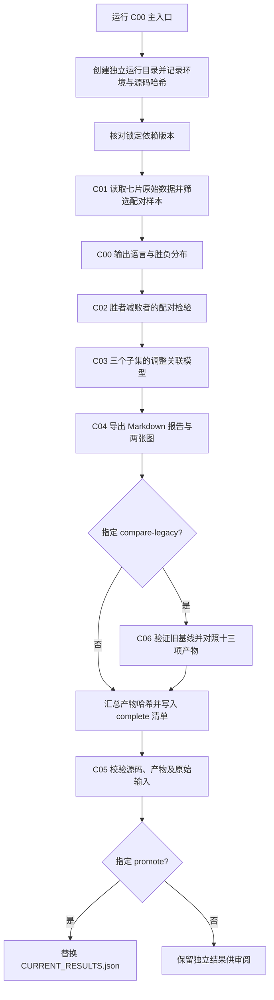

# 新工程运行流程、设计逻辑与功能详解

本文依据当前 `Codes/` 源码编写，说明迁移后的活动工程。阅读顺序建议为：研究问题 → 运行流程 → 模块职责 → 统计解释 → 运行与校验。当前结果入口为根目录 `CURRENT_RESULTS.json`，不能仅凭文件时间或运行目录名称判断哪个结果正在使用。

## 1. 工程要回答什么问题

工程以同一评价会话中的 A、B 两组回答为配对单位，研究回答长度、标题、列表、加粗等文本特征与人类选择之间的观察性关联。主分析分为两层：

1. **配对描述层**：明确胜负的配对中，胜者与败者在长度和格式上有何差异？差异方向是否系统偏离对半分布？
2. **调整关联层**：同时考虑长度、格式、任务、提示词属性、语言和模型身份后，各文本特征与 A 获胜的条件关联如何？英语、单轮子集中是否保持相近方向？

这里没有训练或调用大语言模型。程序读取已有的人类偏好记录及上游标注，进行样本筛选、统计建模和结果追踪。长度和格式来自原始数据的元信息，当前代码不会重新分词或从回答正文重新解析 Markdown。

研究单位是“一个唯一会话的第一次评价”，其中可以包含多轮对话。`evaluation_order == 1` 表示第一次评价，`turns == 1` 才表示单轮对话，两者不能混同。会话唯一也不等于用户唯一或提示词唯一。

## 2. 总体运行流程



实际执行顺序中，可选的 **C06 在最终 C05 校验之前**，编号不等于严格执行顺序。C01 返回的同一份内存 DataFrame 传给 C02、C03、C04，同时保存为 Parquet 供追溯；后续阶段不是每次重新读取该 Parquet。

C00 是顺序执行的单进程流水线，数值库内部线程数固定为 2。没有阶段缓存恢复、自动重试或从某一阶段继续运行的命令行选项。中途失败后应使用新运行编号重跑。

## 3. 目录与命名设计

| 位置 | 功能与使用方式 |
| --- | --- |
| `Codes/` | 当前分析源码、主入口和轻量 Notebook 入口 |
| `Data/lmarena-aiarena-human-preference-140k/Data/` | 七个上游原始 Parquet 分片；完整运行的必要输入 |
| `Data/analysis_data/<run-id>/` | 派生分析数据和歧义会话记录；不公开提交 |
| `Reports/<run-id>/` | 运行清单、输入清单、分析报告、可选旧版对照报告 |
| `Tables/<run-id>/` | 样本统计、配对检验、回归汇总、标准化参数和全系数表 |
| `Pictures/<run-id>/` | 样本计数图及调整关联图 |
| `CURRENT_RESULTS.json` | 指向当前认可运行，保存清单路径、清单哈希和报告路径 |
| `tests/` | 数据提取、统计函数、目录隔离和结果完整性等自动检查 |
| `.github/workflows/` | 在 GitHub 推送及拉取请求时执行测试和公开产物校验 |
| `Legacy/` | 旧源码、Notebook、缓存、图表、运行及结项材料的归档 |
| `基于大语言模型输出文本的选择偏好研究/` | 论文工作稿；不是 C00 的分析输入或自动输出目标 |

当前分析链的标准产物目录由 `accessor.py` 明确规定。根目录其他工作目录（如 `output/`）不属于这条链的标准产物映射。

命名延续 Cxx（代码）、Rxx（报告）、Txx（表）、Pxx（图）的习惯。**新旧工程同号文件不一定表达同一种统计含义**，引用时应同时给出目录、运行编号和文件名。

## 4. 各模块的具体功能

### 4.1 `accessor.py`：路径、产物和哈希的公共基础

它把分析过程中的逻辑文件名与实际编号文件名分开。例如，模块写入 `out / 'paired_tests.csv'` 时，实际路径是 `Tables/<run-id>/T02_paired_tests.csv`。

主要组件如下：

| 组件 | 功能 |
| --- | --- |
| `ROOT` | 从源码文件位置确定工程根目录，避免依赖命令执行时的工作目录 |
| `CRITERIA` | 统一七种提示词属性字段，保证提取与回归使用同一字段列表 |
| `ARTIFACTS` | 集中维护逻辑产物名到目录及实际文件名的映射 |
| `RunPaths` | 校验运行编号、生成路径、创建独立目录、输出工程相对路径 |
| `digest()` | 分块读取文件并计算 SHA-256，避免为哈希一次读入整个文件 |
| `write_json()` | 使用 UTF-8 输出格式化 JSON，禁止写入非标准 NaN 数值 |

运行编号长度为 1–80，只允许英文字母、数字、下划线、短横线，首字符必须是字母或数字。创建前检查四类产出目录，只要任意一个同编号目录存在就拒绝运行。这保护已有结果，但并非跨进程事务锁。

### 4.2 `C00_run_all.py`：统一调度与运行状态管理

C00 负责组织流程，不承担具体统计公式计算。

1. 在导入数值库前，将 `OPENBLAS_NUM_THREADS`、`MKL_NUM_THREADS`、`OMP_NUM_THREADS` 设为 2。
2. 解析 `--run-id`、`--compare-legacy`、`--promote`。默认编号由 UTC 时间生成。
3. 创建运行目录，读取锁定依赖的已安装版本。
4. 对 `Codes/` 顶层全部 `.py`、`.ipynb` 和依赖锁文件计算哈希，记录 Python、平台、依赖及线程设置，写入 `running` 清单。
5. 拒绝依赖版本不一致的运行，依次调用数据准备、配对检验、回归和导出函数；语言与胜负分布由 C00 自己生成。
6. 如有旧基线参数，调用 C06；汇总样本数和全部实际产物哈希。
7. 写入 `complete` 清单，再调用 C05 校验源码、产物和原始数据。
8. 仅指定 `--promote` 且校验通过时，先写临时指针，再替换 `CURRENT_RESULTS.json`。

计算阶段的异常会将清单改为 `failed`，记录错误和结束时间，再向外抛出异常。目录创建、依赖版本读取等部分初始化操作位于异常处理范围之前；若此时缺包或失败，可能只留下部分目录。硬终止也可能留下未完成清单。因此，不能仅看目录存在或某个表已经生成就判定成功。

代码先写 `complete` 再执行最终验证；正常捕获到验证失败时会改为 `failed`。若在这一短暂间隔被强制终止，仍须独立执行 C05 核验，不能只看状态字段。

### 4.3 `C01_prepare_data.py`：从原始记录构建分析样本

`rebuild(out)` 固定要求 `train-00000-of-00007.parquet` 至 `train-00006-of-00007.parquet` 全部存在。它记录每片路径、行数和 SHA-256，只读取所需列，以每批 512 条遍历；清洗后的记录仍累计在内存中，并非全过程常量内存。

`extract(row)` 按下列顺序判断一条记录能否进入样本：

| 检查 | 目的及处理 |
| --- | --- |
| 评价次序为 1 | 排除同一研究流程中的后续评价记录 |
| 两侧对话非空且消息数为偶数 | 要求完整的用户—助手轮次结构 |
| 角色严格交替 | 每轮必须是 `user` 后接 `assistant` |
| 内容段含非空文本 | 排除缺少有效文本的内容 |
| 两侧用户文本序列完全相同 | 保证比较基于相同的用户提问轨迹 |
| 语言不为 `None` 或 `<err>` | 排除明确的语言标注失败 |
| 创作、指令遵循、数学、代码标注有效 | 要求任务标签为布尔值，转换为 0/1 |
| 七种提示词属性有效 | 要求属性标注为布尔值，转换为 0/1 |
| 两侧助手 token 数有效 | 要求有限且大于零，使比例、对数和密度可计算 |
| 标题、列表、加粗计数字典有效 | 检查计数容器及非负值，并将字典内计数相加 |
| 用户 token 数有效 | 要求有限且非负，用于控制输入规模 |

两侧用户轨迹一致并不代表两侧此前助手回答一致，多轮对话的回答历史仍可不同。

每条未通过记录按**第一次失败原因**计数，所以流失表不是每一种数据问题的独立发生率。原始 ID 重复或胜负标签未知会直接报错，不能按普通排除记录继续运行。

逐条筛选完成后，在候选保留样本中查找重复 `evaluation_session_id`。对这些歧义会话，程序记录所有相关 ID，并排除该会话的全部候选记录，不任意保留第一条。最后要求样本非空、会话 ID 非缺失且唯一。

输出数据中的重要字段：

| 字段 | 含义 |
| --- | --- |
| `id`、`evaluation_session_id`、`evaluation_order` | 原始记录及评价会话追踪字段 |
| `model_a`、`model_b`、`winner` | 对战模型及四分类结果：A 胜、B 胜、平局、双方均差 |
| `language`、`turns` | 语言及对话轮数 |
| `cw`、`if`、`math`、`code` | 创作、指令遵循、数学、代码四类任务标记，可同时为真 |
| `complexity`、`creativity`、`domain_knowledge`、`problem_solving`、`real_world`、`specificity`、`technical_accuracy` | 上游提示词属性标记，不能当成对回答质量的独立评分 |
| `tokens_a/b`、`header_a/b`、`list_a/b`、`bold_a/b` | 上游提供的两侧助手长度及格式统计 |
| `user_tokens` | 上游提供的用户输入 token 统计 |

当前检查针对已有上游数据结构，并非通用的嵌套数据 schema 验证器。缺失嵌套对象、非常规类型等问题仍可能直接触发异常。

### 4.4 `C02_paired_tests.py`：胜者与败者的配对差异

只将 `winner` 为 `model_a` 或 `model_b` 的记录纳入检验。对于某个特征，先计算 A 减 B，再根据胜者方向乘以 +1 或 −1，最终统一为：

```text
d = 胜者特征值 − 败者特征值
```

这样正值总表示胜者的该项特征更多，不会将 A、B 展示位置混入胜败解释。

检验覆盖以下子集：全量 `full`、英语 `english`、单轮 `single_turn`，以及四种任务标签组成的 16 种互斥组合。任务掩码为 `cw×1 + if×2 + math×4 + code×8`；例如 `task_mask_0011` 是创作与指令遵循同时为真，数学和代码为假。明确胜负样本为空的组合跳过。

每个有效子集最多输出 10 个指标：token 数一个；标题、列表、加粗各三个。

| 测量方式 | 定义与意义 |
| --- | --- |
| `count` | 比较原始长度或格式计数 |
| `per_1000_tokens` | 格式计数除以各自 token 数再乘 1000，比较格式使用密度 |
| `presence_mcnemar_exact` | 比较是否至少出现一次该格式，差值只能为 −1、0、1 |

`paired(d)` 输出总配对数、非零差值数、正差值数、相等数、非零差值中的正向比例及精确二项置信区间，同时提供差值中位数、双侧符号检验 p 值、秩二列相关和补充 Wilcoxon p 值。正向比例的分母是非零差值数，中位数则基于包括零在内的全部差值。

符号检验考察非零差值中正、负方向是否各占一半；用于格式出现与否时，对不一致配对的二项检验等价于精确 McNemar 检验。秩二列相关按非零绝对差的秩计算，正值表示胜者方向更强。

全部报告子集、全部指标的符号/McNemar 检验一起构成一个 Holm 校正家族。`p_holm` 对应 `p_sign`，**不对应**补充的 `p_wilcoxon`。Wilcoxon 使用渐近方法，未做多重校正，差值分布对称性也未得到保证。

全部差值为零时，p 值设为 1、秩二列相关为 0，正向比例及其区间缺失；不可将缺失比例读成 0。

### 4.5 `C03_adjusted_associations.py`：多变量调整后的关联

该模块分别在全量、英语、单轮的明确胜负样本中拟合二项 GLM，采用默认 logit 链接：因变量 `Y=1` 表示 A 胜，`Y=0` 表示 B 胜。与 C02 不同，这里始终保持 A 减 B 的方向，由因变量表达胜负。

四个核心解释变量为：

```text
长度：log(tokens_a / tokens_b)
标题：1000 × (header_a / tokens_a − header_b / tokens_b)
列表：1000 × (list_a / tokens_a − list_b / tokens_b)
加粗：1000 × (bold_a / tokens_a − bold_b / tokens_b)
```

长度使用对数比例，使“相对长多少”进入模型；格式使用密度差，减少原始格式计数随回答长度机械增长的影响。四项同时入模，但这不保证已经消除了所有混杂。

每个核心变量在各自分析子集中按 `(x−均值)/标准差` 标准化，标准差使用 `ddof=0`；均值和标准差另存为 scaling 表。因此，OR 的单位是该子集的一标准差，跨子集不能直接当作相同原始增量来比较。

控制项包括：`log1p(user_tokens)`、轮数、四种任务标记、七种提示词属性、语言虚拟变量和模型身份对比。每个子集中出现少于 100 次的语言合并为 `__rare__`；语言虚拟变量省略一个参考类别。

模型身份采用类似 Bradley–Terry 的对比编码。对模型 m，变量为 `I(model_a=m)−I(model_b=m)`，分别取 +1、−1 或 0；按名称排序后的第一个模型作为参考而省略。这使模型身份以 A、B 相对差异进入方程，没有另用胜率构造“能力分数”。

模型结构可写为：

```text
logit[P(A胜)] = 截距 + 四项标准化文本特征
                + 输入、任务、属性、语言控制项
                + A/B模型身份对比项
```

拟合前删除常量列、加入截距并检查设计矩阵满秩。若仍秩亏则报错，不继续输出不可识别结果。拟合最多 150 次迭代，采用 HC0 稳健协方差；未收敛或系数非有限值时失败。

主要输出字段的读法：

| 字段 | 解释 |
| --- | --- |
| `coefficient` | 标准化核心变量对应的 log-odds 系数 β |
| `robust_se` | HC0 稳健标准误 |
| `odds_ratio` | `exp(β)`；OR 大于 1 表示该变量增大与 A 获胜优势增加相关 |
| `ci_low/high` | `exp(β ± 1.96×SE)`，逐项 95% 区间 |
| `p_value`、`p_holm` | 原始 p 值及对三个模型共 12 个核心系数的 Holm 校正值 |
| `log_p_value` | 对数 p 值，保留极小概率的数值信息 |
| `average_derivative_per_sd` | `平均[p_i(1−p_i)]×β`，在各样本预测概率处求导后取平均 |
| `n`、`converged`、`design_rank` | 建模样本数、收敛状态和满秩设计矩阵的列数 |

平均导数不是“实际把变量加一标准差后概率增加多少”的离散变化，也不是因果边际效应。OR 也不是胜率倍数。完整系数表包含控制项，但核心汇总表的 Holm 校正不覆盖全部控制项。

### 4.6 `C04_export_results.py`：把统计产物整理成可读报告与图

它接收清洗数据、C02 表和 C03 表，读取流失统计，生成：

- `R04_analysis_report.md`：样本规模、流失表、全量配对检验、三个模型核心结果、指标定义及研究边界。
- `P01_sample_flow.png`：按筛选原因绘制样本计数横条图，横轴使用对称对数刻度。它不是逐阶段累计剩余人数的流程图。
- `P02_adjusted_associations.png`：三个子集的四个核心 OR 及逐项 95% 区间，横轴为对数刻度，参考线为 OR=1。

绘图使用 `Agg` 后端，可以在没有桌面窗口的环境中生成 PNG。报告中的浮点数以六位有效数字显示，CSV 保留程序输出数值；论文取值应回到 CSV 核对。

### 4.7 `C05_verify_results.py`：完整性检查

它验证一套产物是否与清单记录一致，不重新拟合模型或证明统计结论正确。检查包括：

1. 清单版本为 2，状态为 `complete`。
2. 清单包含全部必需产物；旧版等价性报告为可选项。
3. 当前 `Codes/` 顶层源码/Notebook 与依赖锁的文件集合和哈希符合记录。
4. 各产物存在且 SHA-256 一致。
5. 指定 `--verify-raw` 时，再核对输入清单中的原始文件哈希。
6. 清单引用的文件解析后必须留在工程根目录内。

默认读取 `CURRENT_RESULTS.json` 时，还先核对该指针记录的运行清单哈希。显式使用 `--manifest` 时直接校验指定清单，不要求它是当前指针认可的运行。

`--public-only` 跳过 `Data/` 下派生文件的哈希检查，仍要求清单列出必需产物；它用于缺少本地私有数据的环境，不能代表完整复现。它与 `--verify-raw` 互斥。

### 4.8 `C06_compare_legacy.py`：可选迁移等价性检查

由 C00 的 `--compare-legacy` 触发。基线应是包含 `run.json` 和平铺产物的已完成旧运行目录，例如 `Legacy/Runs/final-v3`。

先确认旧清单完成，并核验可比基线文件自身哈希；再对新旧结果比较：CSV 的相对、绝对容差均为 `1e-12`，Parquet 逐值完全一致，输入清单按 JSON 内容一致。另为每项记录是否字节完全相同；要求可比产物数为 13。

这些比较回答“工程重构是否保留原统计计算结果”。新报告、运行清单及新版图形不作为这十三项基线验收对象。等价性不代表旧统计方法已经得到独立科学验证。

### 4.9 Notebook、测试与持续集成

`C00_all_collection.ipynb` 是轻量入口，默认仅通过当前内核的 `sys.executable` 启动 C05 完整校验。完整计算命令被注释，取消注释后通过子进程调用 C00。Notebook 本身不复制各阶段算法，也不保存历史单元格输出。

Notebook 从当前目录向父目录查找工程，因此应从工程内启动；这与 C00/C05 脚本基于自身文件位置定位根目录的方式有所不同。

`test_reproduce.py` 检查配对方向、符号翻转、零差值、McNemar 对应关系、非有限值拒绝，以及数据提取的基本样例。`test_integration.py` 检查路径映射、编号合法性、防覆盖、越界路径、当前公开产物、Notebook 清洁状态、其他目录启动入口，以及篡改或不完整清单被拒绝。

GitHub Actions 在 Python 3.13.5 环境安装锁定依赖，执行测试和公开产物校验。它不会自动下载七片私有输入并完成全数据重跑。现有测试也不等于覆盖了所有统计和上游 schema 边界。

## 5. 产物对应表与建议阅读顺序

下列文件均位于对应的 `<run-id>` 子目录中。

| 目录 | 文件 | 用途 |
| --- | --- | --- |
| Data/analysis_data | `analysis_data.parquet` | 全部保留样本，包含平局和双方均差 |
| Data/analysis_data | `ambiguous_sessions.csv` | 逐条筛选后出现会话歧义的记录 ID |
| Reports | `R00_run_manifest.json` | 运行环境、状态、计数、源码和产物哈希 |
| Reports | `R01_inputs.json` | 原始分片路径、行数和哈希 |
| Reports | `R04_analysis_report.md` | 首先阅读的综合分析报告 |
| Reports | `R05_legacy_equivalence.json` | 可选的新旧基线对照 |
| Tables | `T01_01_attrition.csv` | 按首次失败原因核对样本流失 |
| Tables | `T01_02_language_outcomes.csv` | 各语言四类胜负分布 |
| Tables | `T02_paired_tests.csv` | 所有子集的配对描述检验 |
| Tables | `T03_adjusted_associations.csv` | 三个模型共 12 个核心关联结果 |
| Tables | `T03_01_scaling_full.csv`、`T03_02_scaling_english.csv`、`T03_03_scaling_single_turn.csv` | 各子集核心变量均值与标准差 |
| Tables | `T03_01_model_full_all_terms.csv`、`T03_02_model_english_all_terms.csv`、`T03_03_model_single_turn_all_terms.csv` | 包含控制项的完整系数表 |
| Pictures | `P01_sample_flow.png` | 样本保留及排除计数展示 |
| Pictures | `P02_adjusted_associations.png` | 核心关联结果及区间展示 |

建议先通过当前指针找到 R04 理解分析，再看 T01 确认总体范围，结合 T02 和 T03 区分未调整差异与调整关联，最后用 R00、R01、C05 检查来源与完整性。

## 6. 运行方法与状态判断

建议使用 CPython 3.13.5。以下命令在工程根目录执行；首次准备环境时安装依赖，已有匹配环境不必重复安装：

```powershell
python -m pip install -r requirements-analysis.lock.txt
python -m unittest discover -s tests -v
```

只核验当前已有结果，不重新分析：

```powershell
python Codes/C05_verify_results.py --verify-raw
```

从七片原始数据完整重跑，默认保留为独立候选结果：

```powershell
python Codes/C00_run_all.py
```

显式命名，并在新运行成功后单独核验它：

```powershell
python Codes/C00_run_all.py --run-id study-review-001
python Codes/C05_verify_results.py --manifest Reports/study-review-001/R00_run_manifest.json --verify-raw
```

执行旧基线对照，并在全链成功后将本次运行设为当前结果：

```powershell
python Codes/C00_run_all.py --run-id study-review-002 --compare-legacy Legacy/Runs/final-v3 --promote
```

示例编号不可重复使用；默认自动生成编号最方便。独立新运行如果未使用 `--promote`，不带 `--manifest` 的 C05 仍然验证原来的当前结果，而不是最新创建的目录。

缺少本地数据时，仅校验公开产物：

```powershell
python Codes/C05_verify_results.py --public-only
```

C01–C04、C06 以函数形式供 C00 调用，没有独立完整运行的 CLI。直接执行这些文件不会自动生成对应阶段产物。C00/C05 支持脚本绝对路径；但 `--manifest`、`--compare-legacy` 的相对参数仍以调用者工作目录为基准。

| 情况 | 判断与处理 |
| --- | --- |
| 同名目录已存在 | 防覆盖机制生效；保留旧目录，换编号 |
| 依赖版本不一致或缺包 | 使用锁定依赖准备环境，再换编号运行 |
| 原始分片缺失 | 完整分析必须补齐七片；公开校验只能检查已有公开产物 |
| 回归秩亏或不收敛 | 本次不能作为有效结果；检查样本和设计矩阵，不应手工把状态改成完成 |
| 源码或产物哈希不匹配 | 查明变动原因；分析代码改变后需新运行，不能只更新哈希让检查通过 |
| 清单为 failed/running 或只有部分文件 | 不视为完成结果，依据错误排查并换编号重跑 |

## 7. 当前结果示例及其解释

截至本文编写时，当前指针为 `integrated-20260920`。下表来自该运行现有清单和统计表，不代表本文重新完成了全量拟合。

| 样本阶段/结果 | 数量 |
| --- | ---: |
| 原始七片输入 | 135,634 |
| 排除非首次评价 | 27,319 |
| 排除无效语言 | 30 |
| 排除空或非文本内容 | 109 |
| 排除歧义会话记录 | 22 |
| 最终保留 | 108,154 |
| 明确胜负 | 78,959 |
| 平局 | 16,574 |
| 双方均差 | 12,621 |

明确胜负进一步包括 A 胜 39,042、B 胜 39,917。英语模型使用 42,001 对，单轮模型使用 67,608 对；它们与全量及彼此可以重叠，不是三组相互独立的实验。

全量模型中，每子集内一标准差对应的长度 OR 约为 1.620、标题密度 OR 约为 1.028、列表密度 OR 约为 0.987、加粗密度 OR 约为 1.056。列表在当前 Holm 校正后未达到常用 0.05 阈值。长度 OR=1.620 表示条件获胜优势的比例关联，不表示胜率增加 62%，更不表示主动增加长度就能带来该提升。

## 8. 设计逻辑、边界与维护方式

**数据来源可追踪。** 每次从完整原始分片读取，记录来源哈希，避免把历史派生缓存误当新输入。筛选规则在 C01 集中实现，T01 提供人数核算。

**统计层次明确。** C02 描述胜败双方差异，C03 给出控制已观测变量后的条件关联，两者回答不同问题。配对比较减少提问差异，但仍不能消除题目级回答质量差异。

**一次运行形成一个可检查的产物集合。** 统一运行编号关联四个目录，清单关联源码、输入和输出。旧运行不被覆盖，新运行默认不改变当前指针，使“进行一次分析”和“将结果用于当前引用”分开。

**分析与展示分离。** C01–C03 负责数据及统计，C04 负责展示，公共路径由 accessor 管理。增加指标时，应同时明确筛选要求、计算尺度、多重检验家族、输出映射和报告含义。

**工程等价性与科学有效性分别判断。** C05 检查文件完整性，C06 检查旧基线结果是否保留；二者都不证明因果解释成立。SHA-256 追踪也不是数字签名或防恶意篡改系统。

当前仍有以下解释边界：同一用户或提示词可能跨会话重复，HC0 不提供相应聚类修正；时间漂移未充分处理；没有独立的回答质量测量；只分析明确胜负及严格文本配对会改变目标总体；小任务组合估计可能不稳定。逐项 95% 区间不是多重比较同时区间，极小 p 值在 CSV 中显示为 0 可能只是浮点下溢。

旧 IPW、匹配、SEM 及旧“纯效应”说法属于 Legacy 审计材料，不是当前推断依据。新工程也不会自动替换论文工作稿中的旧表和结论，论文引用应显式对应当前运行产物。

修改 `Codes/` 顶层任意 `.py/.ipynb` 或锁文件后，旧运行对当前源码的校验会失败，即使只是源码注释变化。应保留旧版本追溯并建立新运行，不手改旧清单掩盖变化。仅新增本说明或修改根目录 README 不在当前源码哈希清单范围内。

相关入口：[项目首页](README.md)、[复现说明](REPRODUCIBILITY.md)、[新旧对应](UNIFICATION.md)、[迁移记录](MIGRATION.md)、[当前结果摘要](RESULTS_REBUILT.md)。
