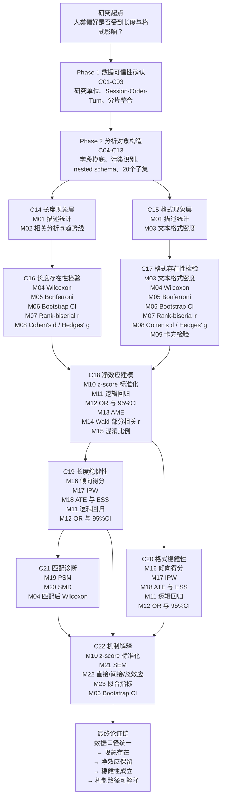

# 统计方法逻辑链条图

> 用途：把 C14-C22 中真正进入结果解释的统计方法，按课题研究推进顺序压缩成一条从“现象识别”到“机制解释”的方法链。
> 适用场景：课堂展示、组会汇报、论文框架梳理、零基础读者快速建立全局地图。

---

## 1. 一图总览

---

## 2. 这张图应该怎么读

### 2.1 先看“研究层次”，再看“方法名字”

这张图不是按教材章节排方法，而是按课题真正推进的顺序排：

1. 先确认数据能不能分析。
2. 再把原始嵌套对象整理成统一口径的分析对象。
3. 然后用描述统计和正式检验确认偏好现象是否存在。
4. 再用回归、IPW 和匹配判断这些现象是不是被混淆放大。
5. 最后用 SEM 把长度、格式和偏好结果放进同一机制框架。

### 2.2 方法不是并列堆叠，而是层层加码

这条分析链的核心不是“方法越多越好”，而是每一层都在回答更严格的问题：

- M01-M03：先把数据和现象说清楚。
- M04-M09：再判断这些现象是否具有统计上的稳定性。
- M10-M15：继续追问控制变量后还剩多少净效应。
- M16-M20：再换一种处理效应与可比性框架检验结论是否稳健。
- M21-M23：最后把已经保留下来的核心变量放进机制模型，解释它们如何共同进入偏好形成。

### 2.3 为什么有些方法会重复出现

图里有些方法会在不止一个节点出现，例如：

- M04 Wilcoxon：既用于正式存在性检验，也用于匹配后的再验证。
- M06 Bootstrap：既用于差异区间，也用于 IPW 和 SEM 的复杂效应区间。
- M10 z-score 标准化：既服务于嵌套回归，也服务于 SEM。
- M11-M12：既用于 C18 的净效应模型，也用于 C19-C20 的稳健性回归。

这不是重复，而是说明这些方法在不同层次承担了不同任务。

---

## 3. 方法分层速记

| 层级 | 对应脚本 | 方法编号 | 核心任务 |
| --- | --- | --- | --- |
| 现象层 | C14-C15 | M01-M03 | 看清长度和格式现象大致长什么样 |
| 存在性检验层 | C16-C17 | M04-M09 | 判断偏好是否系统存在 |
| 净效应层 | C18 | M10-M15 | 控制混淆后还剩多少核心效应 |
| 稳健性与可比性层 | C19-C21 | M16-M20 | 换估计框架后结论是否仍成立 |
| 机制层 | C22 | M21-M23 | 解释变量通过哪些路径影响偏好 |

---

## 4. 和其他文档怎么配合阅读

建议顺序如下：

1. 先看本文件，建立整条研究逻辑的全局地图。
2. 再看 `introduction_index.md` 与 phase 1-5，理解每一阶段为什么要这样推进。
3. 然后结合 `method_list.md`，按 M01-M23 顺序进入各方法入门文档。
4. 最后回到 C14-C22 的脚本和结果文件，把“方法链”和“实际输出”对应起来。

如果只想用一句话概括这条链，可以写成：

**先确认数据可信，再识别现象，再做正式检验，再控制混淆并验证稳健性，最后用机制模型解释偏好是如何形成的。**