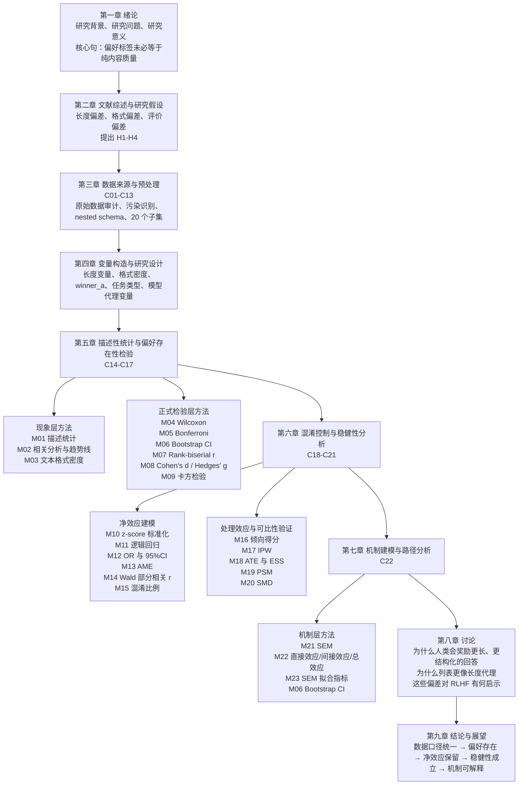
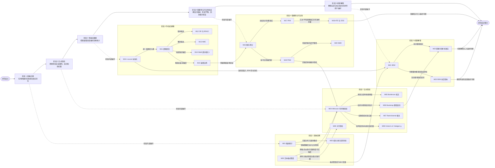

# 论文写作版方法逻辑图与研究时间轴图

> 用途：把当前课题的统计方法链压缩成两张互补的图。  
> 第一张图回答“这些方法在论文里应该放到哪一章”；第二张图回答“这些方法在研究推进中按什么时间顺序展开，以及前后阶段如何承接”。

---

## 1. 论文写作版逻辑图

### 怎么理解这张图

- 第一章和第二章不直接承担统计估计任务，但它们决定后文所有方法为什么值得使用。
- 第三章和第四章是“研究对象定义层”，没有这两章，后面的方法会失去统一口径。
- 第五章是“现象确认层”，重点证明偏好不是视觉错觉。
- 第六章是“结论加压层”，重点证明偏好不只是混淆放大的假象。
- 第七章是“机制解释层”，重点解释长度与格式如何进入最终偏好判断。
- 第八章和第九章不再扩展新方法，而是把前面方法链给出的证据压缩成论文叙事。

---

## 2. 研究时间轴图

### 怎么理解这张时间轴图

- 这张图沿左到右阅读，表示研究实际推进的时间顺序，而不是单纯的分类分层。
- 阶段 1 到阶段 5 仍然保留原有关系结构的核心逻辑，只是把它改写成了研究流程语义。
- M19 回到 M04 的箭头依然保留，表示匹配完成后并不是终点，还要回到配对检验语境重新确认结果。
- M03、M10、M06 跨阶段连到 M21-M22，表示机制建模不是凭空出现，而是吸收前面阶段已经定义好的格式、量纲和区间信息。
- 最后的“研究结论整合”节点表示稳健性证据与机制证据是并行汇总到最终结论中的，而不是只依赖某一个方法输出。

---

## 3. 两张图的配合方式

可以把这两张图理解成两个视角：

1. 第一张图是“论文目录视角”，回答每种方法在写作结构里应该出现在哪一章。
2. 第二张图是“研究推进视角”，回答这些方法在实际研究中按什么顺序展开，以及哪些节点会跨阶段衔接。

如果只看一张，容易出现两个问题：

- 只看论文结构图，容易知道“放在哪一章”，但不清楚研究推进时为什么必须先做这一步再做下一步。
- 只看时间轴图，容易知道“研究怎么推进”，但不清楚写论文时该放在哪个章节中表达。

因此最推荐的用法是：

1. 先看这份文档的第一张图，建立章节地图。
2. 再看第二张图，理解方法链在研究过程中的推进顺序与回流关系。
3. 最后回到 `paper_framework.md`、`method_list.md` 和各 M01-M23 文档，把图上的节点和实际文本说明对起来。